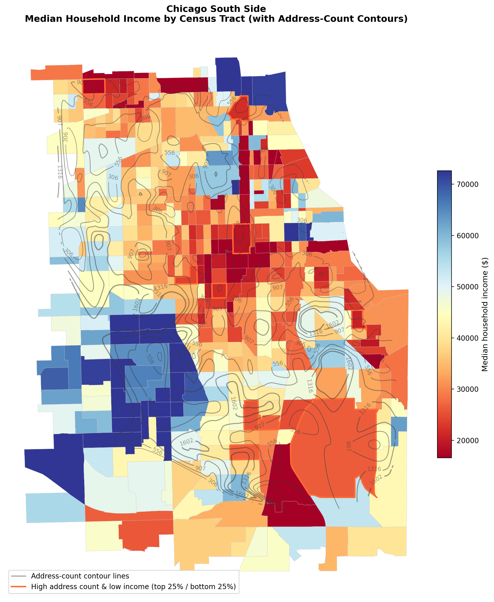

## Research question

Do higher-density tracts in Chicago’s South Side tend to be lower-income and have higher uninsured rates?  
After accounting for income, does density still correlate with uninsured rates?

## Data

- Census tract boundaries: Illinois census tract shapefile (`data/il_tract.*`)
- Address points: `data/obama_addresses_mappable_t.csv`
- Tract-level socioeconomic variables (embedded in the merged tract GeoJSON created by preprocessing)

## Methods (overview)

1. Aggregate address records to census tracts to compute **address density (addresses per sq km)**.
2. Join tract geometries with socioeconomic attributes.
3. Visualize spatial patterns (choropleth + density contours) and bivariate relationships (scatter plots).

## Results

### Figure 1: Spatial distribution

### Figure 2: Relationships

Open the interactive scatter plot: `data/derived-data/figure2_scatter.html`

## Policy implications

Highlight tracts that are simultaneously:
- High address density
- Low income
- High uninsured rate

These tracts may be candidates for targeted outreach or resource allocation.

## Reproducibility

To reproduce outputs:

1. Preprocess:
   - `python code/preprocessing.py`
2. Generate figures:
   - `python code/figures.py`
3. Run Streamlit app:
   - `streamlit run streamlit-app/app.py`