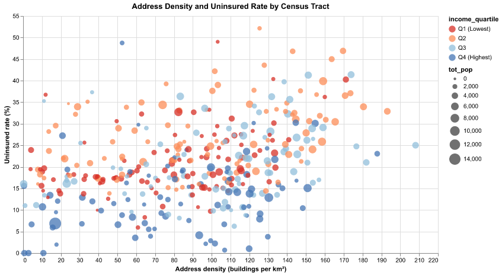

\vspace{-2em}

**Group Members:** Grace Yao, Jiamin Zhang, Yuxin Zheng  
**Section:** Tuesday 11:00 am – 12:20 pm, Section 4  
**GitHub:** GraceYYYY07, Yuxin217-u, jasmine420222

```{python}
#| label: setup
import warnings
warnings.filterwarnings("ignore")

from pathlib import Path

import numpy as np
import pandas as pd
import geopandas as gpd
from shapely.geometry import Point

import matplotlib.pyplot as plt
from matplotlib.cm import ScalarMappable
from matplotlib.colors import Normalize
from matplotlib.lines import Line2D

from scipy.interpolate import griddata
import altair as alt
```

## Motivation and Research Question

Chicago’s South Side has long experienced substantial economic inequality and disparities in access to healthcare. Income differences may play an important role in insurance coverage. Lower-income households may face greater financial barriers to purchasing health insurance, and workers in lower-wage jobs are also less likely to receive employer-sponsored insurance. In addition to income, residential patterns may also matter. Areas with higher housing density may include more informal housing arrangements, transient populations, or workers employed in sectors that are less likely to provide employer-sponsored insurance. If this mechanism is important, neighborhoods with higher density may exhibit higher uninsured rates. 

Motivated by these considerations, this project has the following descriptive research question: How are housing density and neighborhood income associated with uninsured rates at the census tract level in Chicago’s South Side?

```{python}
# Preprocessing
#| output: false

ROOT = Path(".").resolve()
DATA_DIR = ROOT / "data"
RAW_DIR = DATA_DIR / "raw-data"
DERIVED_DIR = DATA_DIR / "derived-data"
DERIVED_DIR.mkdir(parents=True, exist_ok=True)

CSV_PATH = RAW_DIR / "address_data.csv"
SHP_PATH = RAW_DIR / "il_tract.shp"
OUT_PATH = DERIVED_DIR / "merged_tract.geojson"

# Step 1 & 2: Load address CSV and convert to GeoDataFrame
df = pd.read_csv(CSV_PATH)
df = df.dropna(subset=["lat", "lon"])
geometry = [Point(lon, lat) for lon, lat in zip(df["lon"], df["lat"])]
addr_gdf = gpd.GeoDataFrame(df, geometry=geometry, crs="EPSG:4326")

# Step 3: Load census tract shapefile, subset Cook County
tracts = gpd.read_file(SHP_PATH)
cook_tracts = tracts[tracts["COUNTYFP"] == "031"].copy()
cook_tracts = cook_tracts.to_crs("EPSG:4326")

# Step 4: Spatial join
joined = gpd.sjoin(
    addr_gdf,
    cook_tracts[["GEOID", "geometry"]],
    how="left",
    predicate="within"
)
addr_counts = (
    joined
    .groupby("GEOID")
    .agg(
        addr_count=("BLDG_ID", "count"),
        unit_count=("NO_OF_UNIT", "sum"),
    )
    .reset_index()
)

# Step 5: Clean ACS variables
cols_check = ["med_hh_inc", "pct_no_hlt", "pop_0_17", "tot_pop"]
for col in cols_check:
    if col not in cook_tracts.columns:
        raise ValueError(f"Missing required column in tract shapefile: {col}")
for col in cols_check:
    if col == "med_hh_inc":
        cook_tracts.loc[cook_tracts[col] <= 0, col] = np.nan
    elif col in ["pop_0_17", "tot_pop"]:
        cook_tracts.loc[cook_tracts[col] <= 0, col] = np.nan
    elif col == "pct_no_hlt":
        cook_tracts.loc[cook_tracts[col] < 0, col] = np.nan
    median_val = float(cook_tracts[col].median())
    cook_tracts[col] = cook_tracts[col].fillna(median_val)

# Step 6: Merge and compute densities
merged = cook_tracts.merge(addr_counts, on="GEOID", how="left")
merged["addr_count"] = merged["addr_count"].fillna(0).astype(int)
merged["unit_count"] = merged["unit_count"].fillna(0).astype(float)
area_gdf = merged.to_crs(epsg=3435)
merged["area_sqkm"] = area_gdf.geometry.area / 1_000_000
merged.loc[merged["area_sqkm"] <= 0, "area_sqkm"] = np.nan
merged["addr_per_sqkm"] = merged["addr_count"] / merged["area_sqkm"]
merged["unit_per_sqkm"] = merged["unit_count"] / merged["area_sqkm"]
merged["pop_per_sqkm"]  = merged["tot_pop"]    / merged["area_sqkm"]

# Step 7: Subset to South Side
merged["centroid_lat"] = merged.geometry.centroid.y
merged["centroid_lon"] = merged.geometry.centroid.x
south_side = merged[
    (merged["centroid_lat"] >= 41.63) &
    (merged["centroid_lat"] <= 41.87) &
    (merged["centroid_lon"] >= -87.76) &
    (merged["centroid_lon"] <= -87.52)
].copy()
south_side = south_side.drop(columns=["centroid_lat", "centroid_lon"])

# Step 8: Income quartiles
south_side["income_quartile"] = pd.qcut(
    south_side["med_hh_inc"], q=4,
    labels=["Q1 (Lowest)", "Q2", "Q3", "Q4 (Highest)"]
)

# Step 9: Save
south_side.to_file(OUT_PATH, driver="GeoJSON")
```

## Data and Approach

We combine two datasets for this analysis.

The first dataset is a residential address dataset containing approximately 489,000 building address records with geographic coordinates derived from Chicago Data Portal. These address points are used to construct a proxy for residential density. The second dataset is the Illinois Census tract shapefile, which provides tract boundaries along with socioeconomic variables derived from the U.S. Census Bureau’s TIGER/Line Shapefiles, including median household income and uninsured rates.

In an earlier version of the project we used the dataset `obama_addresses_mappable_t.csv`, which only covered the area surrounding the Obama Presidential Center. Because that dataset represented only a small portion of Chicago’s South Side and produced many tracts with zero density values, we replaced it with a larger address dataset covering the broader region (`address_data.csv`).

Address coordinates are converted into geographic points and spatially joined with census tract polygons. We use address points instead of census household counts because they provide a finer spatial proxy for residential concentration and better visualize how buildings are distributed across tracts. Addresses are then aggregated by census tract to calculate address density, measured as building addresses per square kilometer. These density measures are merged with tract-level income and uninsured rate data to construct the final dataset used in the analysis.

## Static Visualizations

### Figure 1: Median Income by Census Tract

Figure 1 presents a spatial map of Chicago’s South Side at the census tract level. Tracts are colored by median household income, with red indicating lower-income areas and blue indicating higher-income areas. Contour lines represent housing density derived from address counts and indicate areas where residential addresses are more concentrated. The map shows that lower-income tracts cluster in several central areas of the South Side, and many of these same areas also exhibit relatively high housing density. This spatial overlap suggests that dense residential areas often coincide with economically disadvantaged neighborhoods and provides descriptive evidence relevant to our research question by illustrating how income and housing density vary across neighborhoods.

```{python}
#| fig-width: 5.8
#| fig-height: 5

DATA_PATH = DERIVED_DIR / "merged_tract.geojson"
OUT_DIR = DERIVED_DIR

def _require_columns(df, cols, name):
    missing = [c for c in cols if c not in df.columns]
    if missing:
        raise KeyError(f"{name} is missing required columns: {missing}")

gdf = gpd.read_file(DATA_PATH)
gdf_plot = gdf.copy().to_crs(epsg=3857)

vmin = gdf_plot["med_hh_inc"].quantile(0.05)
vmax = gdf_plot["med_hh_inc"].quantile(0.95)

fig, ax = plt.subplots(figsize=(5.8,5))

fig.patch.set_facecolor("white")
ax.set_facecolor("white")

gdf_plot.plot(
    column="med_hh_inc",
    cmap="RdYlBu",
    linewidth=0.25,
    edgecolor="#c7c7c7",
    legend=False,
    ax=ax,
    vmin=vmin,
    vmax=vmax,
    missing_kwds={"color": "#efefef"},
)

density_tracts = gdf_plot[gdf_plot["addr_count"] > 0].copy()
if len(density_tracts) > 10:
    with warnings.catch_warnings():
        warnings.simplefilter("ignore")
        density_tracts["cx"] = density_tracts.geometry.centroid.x
        density_tracts["cy"] = density_tracts.geometry.centroid.y

    x = density_tracts["cx"].to_numpy()
    y = density_tracts["cy"].to_numpy()
    z = density_tracts["addr_count"].to_numpy(dtype=float)

    xi = np.linspace(x.min(), x.max(), 200)
    yi = np.linspace(y.min(), y.max(), 200)
    xi, yi = np.meshgrid(xi, yi)
    zi = griddata((x, y), z, (xi, yi), method="cubic")

    p25 = float(np.nanpercentile(z, 25))
    p50 = float(np.nanpercentile(z, 50))
    p75 = float(np.nanpercentile(z, 75))
    p90 = float(np.nanpercentile(z, 90))
    p95 = float(np.nanpercentile(z, 95))
    levels = sorted(set([round(v) for v in [p25, p50, p75, p90, p95] if v > 0]))

    contour = ax.contour(
        xi, yi, zi,
        levels=levels,
        colors=["#3b3b3b"],
        alpha=0.5,
        linewidths=[0.8, 1.0, 1.1, 1.3, 1.6],
    )
    ax.clabel(contour, inline=True, fontsize=8, fmt="%d", colors="#3b3b3b")

addr_hi = float(gdf_plot["addr_count"].quantile(0.75))
inc_lo  = float(gdf_plot["med_hh_inc"].quantile(0.25))
highlight = gdf_plot[
    (gdf_plot["addr_count"] >= addr_hi) &
    (gdf_plot["med_hh_inc"]  <= inc_lo)
].copy()

if len(highlight) > 0:
    highlight.plot(ax=ax, color="none", edgecolor="#FF6B35", linewidth=2.0)

norm = Normalize(vmin=vmin, vmax=vmax)
sm = ScalarMappable(cmap="RdYlBu", norm=norm)
sm.set_array([])

cbar = fig.colorbar(sm, ax=ax, fraction=0.03, pad=0.02, shrink=0.75)
cbar.set_label("Median household income ($)", fontsize=10)

legend_elements = [
    Line2D([0], [0], color="#3b3b3b", alpha=0.6, linewidth=1.2,
           label="Address-count contour lines"),
    Line2D([0], [0], color="#FF6B35", linewidth=2.0,
           label="High address count & low income (top 25% / bottom 25%)"),
]

ax.legend(handles=legend_elements, loc="lower left", frameon=True)

ax.set_title("Median Household Income by Census Tract", fontsize=12)

ax.set_axis_off()

plt.tight_layout()
plt.show()
```

### Figure 2: Address Density vs Uninsured Rate

Figure 2 examines how housing density and neighborhood income are associated with uninsured rates across census tracts. Each point represents a tract, colored by income quartile and sized by population. The figure shows a strong relationship between income and uninsured rates: lower-income tracts consistently exhibit higher uninsured rates, while higher-income tracts tend to have substantially lower uninsured rates. In contrast, housing density alone does not strongly predict uninsured rates, as tracts with similar density levels can exhibit very different uninsured rates depending on their income levels. This pattern suggests that income differences play a larger role in explaining insurance disparities than housing density itself.

```{python}
#| label: fig-scatter
#| fig-width: 4.8
#| fig-height: 3.6

#| echo: false
import geopandas as gpd
import altair as alt

gdf = gpd.read_file("data/derived-data/merged_tract.geojson")
df = gdf[gdf["addr_per_sqkm"] > 0].copy()
df = df.drop(columns=["geometry"])
df["addr_per_sqkm"] = df["addr_per_sqkm"].astype(float)
df["uninsured_pct"] = df["pct_no_hlt"] * 100
df["income_quartile"] = df["income_quartile"].astype(str)

chart = (
    alt.Chart(df).mark_circle(opacity=0.75)
    .encode(
        x=alt.X("addr_per_sqkm:Q", title="Address density (buildings per km²)", scale=alt.Scale(zero=False)),
        y=alt.Y("uninsured_pct:Q", title="Uninsured rate (%)"),
        size=alt.Size("tot_pop:Q", scale=alt.Scale(range=[20, 400])),
        color=alt.Color("income_quartile:N", scale=alt.Scale(
            domain=["Q1 (Lowest)", "Q2", "Q3", "Q4 (Highest)"],
            range=["#d73027", "#fc8d59", "#91bfdb", "#4575b4"]))
    )
    .properties(width=700, height=400, title="Address Density and Uninsured Rate by Census Tract")
)

reg = chart.transform_regression("addr_per_sqkm", "uninsured_pct").mark_line(color="black", strokeDash=[5,3])
final_chart = chart + reg

# PNG
final_chart.save("data/derived-data/figure2_scatter.png")
```


## Streamlit App

The dashboard includes an interactive map displaying census tracts and key indicators, including uninsured rates, income, and housing density. The app also shows scatter plots of housing density or income versus uninsured rates. It includes threshold sliders that allow users to define “priority tracts” based on low income, high uninsured rates, and high housing density. The app identifies tracts meeting the selected conditions and generates a prioritized list of neighborhoods that may warrant policy attention. Users can also define priority tracts using quantile thresholds (e.g., top 25% uninsured or lowest 25% income), allowing policymakers to target limited resources to the highest-need areas.

## Weaknesses & Difficulties

First, address counts are only a proxy for residential density and may not accurately reflect the number of households within each tract, particularly in areas with large multi-unit buildings. Second, the analysis is descriptive rather than causal, and uninsured rates may also be shaped by other tract characteristics such as employment structure, demographic composition, or eligibility for public insurance programs. Future work could incorporate more precise measures of housing units and additional socioeconomic variables to better understand the mechanisms linking neighborhood characteristics and insurance coverage.

## Policy Implications

Although this analysis is descriptive, the results suggest that uninsured rates are more strongly associated with income differences than with housing density. Tracts with low income and high uninsured rates may therefore represent areas where policy outreach efforts should be prioritized. The interactive dashboard further allows policymakers to adjust thresholds for income, uninsured rates, and residential density to identify priority tracts under different policy goals. This tool can help guide targeted outreach or enrollment initiatives by highlighting neighborhoods where limited insurance coverage is most concentrated and where additional resources may have the greatest impact.